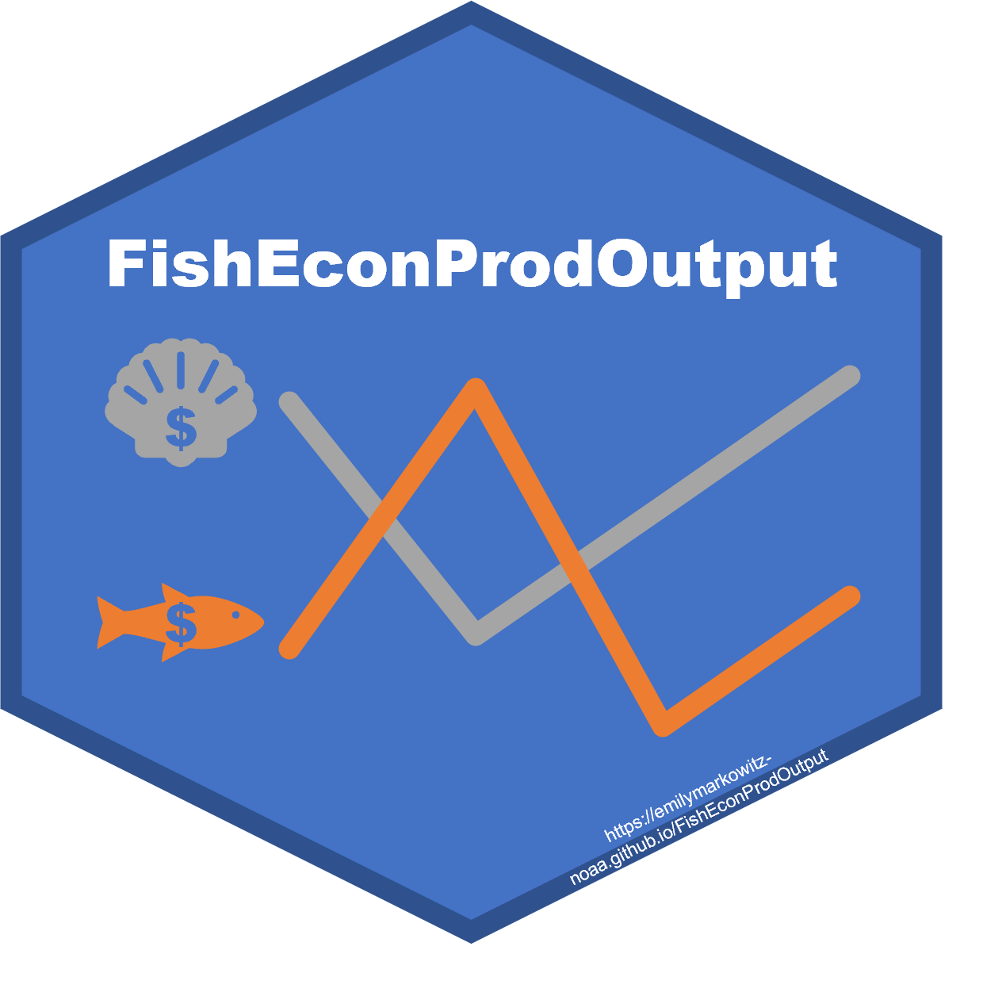

<!-- README.md is generated from README.Rmd. Please edit that file -->

```{r, echo = FALSE, warning=FALSE, message=FALSE}
knitr::opts_chunk$set(
  collapse = TRUE,
  comment = "#>",
  fig.path = "man/figures/",
  fig.height = 1
)
require(ggplot2)
```

```{r echo=FALSE, results="hide", message=FALSE, include=FALSE}
library("badger", quietly = TRUE)
library(here)
```

# FishEconProdOutput <a href={https://emilymarkowitz-noaa.github.io/FishEconProdOutput}>


### *Measuring Output for U.S. Commercial Fisheries From Theory to Practice*

[](https://zenodo.org/badge/latestdoi/291852337)


```{r, echo = FALSE, results='asis', message=FALSE}
cat(
  badge_devel("EmilyMarkowitz-NOAA/FishEconProdOutput", "blue"),
  badge_lifecycle("maturing", "blue"),
  badge_last_commit("EmilyMarkowitz-NOAA/FishEconProdOutput")
)
```


**Emily Markowitz**^1^ (Emily.Markowitz AT noaa.gov)

**John Walden**^2^ (John.Walden AT noaa.gov)

**Sun Ling Wang**^3^ (SunLing.Wang AT usda.gov)

^1^Alaska Fisheries Science Center, National Marine Fisheries Service, National Oceanic and Atmospheric Administration, Seattle, WA 98195

 - *Work completed as a contractor with ECS in the NOAA Fisheries Office of Science and Technology Economics & Social Analysis Division.* 
 
 
^2^Northeast Fisheries Science Center,  National Marine Fisheries Service, National Oceanic and Atmospheric Administration, Woods Hole, MA

^3^United States Department of Agriculture, Economic Research Service 

 - *Work completed while on detail with the NOAA Fisheries Office of Science and Technology Economics & Social Analysis Division.* 

------------

Since many of the original collaborators have changed positions, future maintenance may be provided by: 

**Alex Richardson**^4^ (Alex.Richardson AT noaa.gov)

^4^Contractor with ECS Tech in the NOAA Fisheries Office of Science and Technology Economics & Social Analysis Division, Silver Spring, MD 20910 

*The views expressed are those of the author and should not be attributed to the NOAA, ECS, or ERS*

# Study Purpose

This package provides guidelines on fishery productivity measurement at the individual fishery and aggregate sector levels. Attention is given to the constructions of output and total factor productivity based on available data and a bottom-up approach. Given that there is no nation-wide standard cost survey, we recommend starting with measuring TFP at the fishery level based on a translog gross output production possibility frontier using index number techniques. Special attention is given to measuring quality-adjusted physical capital inputs in the bottom-up approach. 


# Download this package

```{r, echo=TRUE, eval=FALSE}
library(devtools)
devtools::install_github("EmilyMarkowitz-NOAA/FishEconProdOutput", dependencies = TRUE, build_vignettes = T)
library(FishEconProdOutput)
```


# Documentation

**GitHub Repository:** [https://github.com/emilyhmarkowitz/FishEconProdOutput](https://github.com/EmilyMarkowitz-NOAA/FishEconProdOutput)  

**Documentation GitHub Pages:** [https://emilymarkowitz-noaa.github.io/FishEconProdOutput/](https://emilymarkowitz-noaa.github.io/FishEconProdOutput/)


You can find vignettes here

```{r, echo=TRUE, eval=FALSE}
browseVignettes("FishEconProdOutput")
```

Or directly view the vignettes here: 

 - [FEUS-tables](https://emilymarkowitz-noaa.github.io/FishEconProdOutput/articles/FEUS-tables.html): How to create the tables used in FEUS
 - [NEFSC-Fishery](https://emilymarkowitz-noaa.github.io/FishEconProdOutput/articles/NEFSC-Fishery.html): How to use this analysis for a collection of sub fisheries, such as in the Northeast US

# Publications

*A publication on this work in forthcoming.*

# NOAA README

>This repository is a scientific product and is not official communication of the National Oceanic and Atmospheric Administration, or the United States Department of Commerce. All NOAA GitHub project code is provided on an ‘as is’ basis and the user assumes responsibility for its use. Any claims against the Department of Commerce or Department of Commerce bureaus stemming from the use of this GitHub project will be governed by all applicable Federal law. Any reference to specific commercial products, processes, or services by service mark, trademark, manufacturer, or otherwise, does not constitute or imply their endorsement, recommendation or favoring by the Department of Commerce. The Department of Commerce seal and logo, or the seal and logo of a DOC bureau, shall not be used in any manner to imply endorsement of any commercial product or activity by DOC or the United States Government.


# License

>Software code created by U.S. Government employees is not subject to copyright in the United States (17 U.S.C. §105). The United States/Department of Commerce reserve all rights to seek and obtain copyright protection in countries other than the United States for Software authored in its entirety by the Department of Commerce. To this end, the Department of Commerce hereby grants to Recipient a royalty-free, nonexclusive license to use, copy, and create derivative works of the Software outside of the United States.


[U.S. Department of Commerce](https://www.commerce.gov/) | [National Oceanographic and Atmospheric Administration](https://www.noaa.gov) | [NOAA Fisheries](https://www.fisheries.noaa.gov/)
